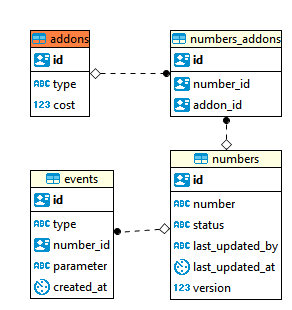

# Assumptions
This is a simple demo application for number block management, so a lot of complex features are not included, for example:
1. number recycle
1. complex event parameter
1. API authorization (e.g. for customer and administrator)
1. HTTPS
1. custom response/error messages
1. unit test

# Solution
## Architecture

There is one single micro-service in the system which has three layers of objects:
1. Controller: end point for REST API
1. Service: contains business logic
1. Repository: for data access

There are three controllers:
1. Number Controller: provides APIs for number provision, quarantine, release, subscribe and terminate.
1. Addon Controller: provides APIs for addons (pre-populated) retrieval
1. Event Controller: provides APIs for events (history) retrieval

## APIs

You can also see APIs after application started and access the Swagger UI. (see the Testing section)

## Database

## Scalability (Horizontal)
1. The micro-service can scale horizontally, probably based on number range/hash (i.e. each micro-service instance is responsible for a number range). UUID is used as primary keys in the database, so there is no conflict among micro-services.
1. Number management, service management and event management may be split into separate micro-services if traffic volume or data storage increases.   
In this case, reference keys and parent-child associations should be removed.

## Performance
1. Scalability ensures manageable traffic volume and data storage on each server
1. Pagination is used for number/event retrieval
1. Indices are used for speeding up some queries (e.g. get events order by number id)
1. Other possible ways (not implemented): cache (e.g. get addon), read replica of database, message queue (e.g. traffic spike)

## Security
1. The micro-service can be split into two: one for customer and the other for administrator (different security zones)

## Privacy
1. UUID is used as primary key in the database, so one user cannot guess other users' number id and retrieve private information

## Race condition handling
1. Unique constraint is added to ensure there is no multiple provisioning of the same number
1. Version is added for detecting conflict updates on numbers (quarantine, release, subscribe and terminate)

# Environment
* IDE: Spring Tool Suite 3.9.2 RELEASE
* OS: Windows 8 / RHEL 7
* DATABASE: H2 (In-memory)
* Language: Java 8
* Framework: Spring Boot, Hibernate, etc.
* Build: Gradle

# Provisioned Data
* Database tables will be created automatically
* The following numbers have been pre-populated: 90000001 - 90000005
* The following addons have been pre-populated: Call Forwarding, Voice Mail, Caller ID, Roaming

# Execution
There are two ways to run the application.

## As Docker image
* Install Docker environment
* Execute: docker pull ivxivx/mr-code-challenge:1.0.0
* Execute: docker run -p 8080:8080 ivxivx/mr-code-challenge:1.0.0

## As Spring Boot application
* Go to [project root]/resources
* Execute: java -jar mr-code-challenge-1.0.0.jar

# Testing
## Using Swagger
* Start the application and access http://localhost:8080/swagger-ui.html  

## Using Postman  
* Download Postman from https://dl.pstmn.io/download/version/5.5.3/windows64
* Install
* Import [project root]/resources/postman.v2.json and start testing from there
